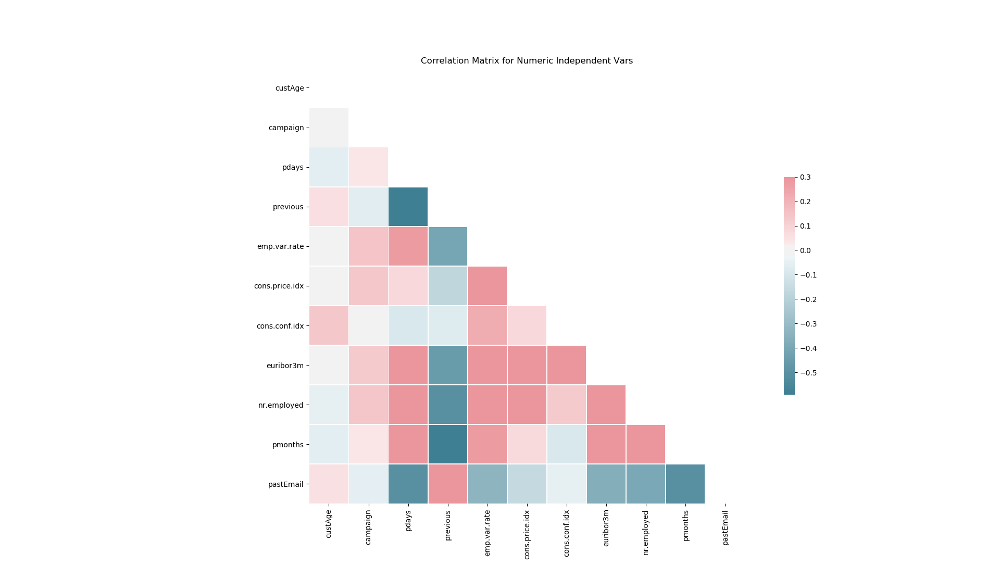

# Classification Model to Determine a Likely Customer

## Order of Operations, Generally
[x] Clean Data
[ ] Exploratory Data Analysis and Visualization
[ ] Create and Train Model
[ ] Test Model
[ ] Optimize Parameters
[ ] (Optional) Repeat for other model types and determine best model
[ ] Visualize Results

I conducted some EDA and looked at the types of data. They are mixed categories (strings) and numerics. The perceived output will be a Yes/No on likely customer. 
This binary output leads me to the following model types.

## Model Types
### Naive Bayes
Advantages: This algorithm requires a small amount of training data to estimate the necessary parameters.
Naive Bayes classifiers are extremely fast compared to more sophisticated methods.
Disadvantages: Naive Bayes is is known to be a bad estimator.

### Logistic Regression
Advantages: Logistic regression is designed for this purpose (classification), and is most useful for understanding the influence of several independent variables
on a single outcome variable.
Disadvantages: Works only when the predicted variable is binary, assumes all predictors are independent of each other, and assumes data is free of missing values.

### Random Forest 
Advantages: Reduction in over-fitting and random forest classifier is more accurate than decision trees in most cases.
Another advantage is that I think RFC allows non-numeric values
Disadvantages: Slow real time prediction, difficult to implement, and complex algorithm.
note:
One thing to remember when we use Random Forest is when you use a categorical feature for training it shouldn't have more than 53 categories. 
Sometimes RandomForest takes numerical data as categorical. To overcome that make sure to convert all categorical as factors using this command.
df['col_name'] = df['col_name'].astype('category')

## EDA
Some of the model types listed above assume independence between independent variables. This is not always the case, so we should test for independence with a correlation matrix.

We can see there are some strong negative correlations between contacts. That makes sense as they would have been contacted in some # of days if they have been contacted before, else that value is 999.

I am leaning towards getting rid of that and turning it into a bool. ˉ\_(ツ)_/ˉ

### Many NaN values
```df_clean = df_clean.replace('unknown', np.NaN)```

```df_clean.isna().sum()```

```
custAge           1804
profession          61
marital              8
schooling         2386
default           1432
housing            168
loan               168
contact              0
month                0
day_of_week        711
campaign             0
pdays                0
previous             0
poutcome             0
emp.var.rate         0
cons.price.idx       0
cons.conf.idx        0
euribor3m            0
nr.employed          0
pastEmail            0
responded            0
p_last_mon           0
```

Unfortunately, I have a feeling that schooling is probably one of the strongest predictors of behavior, as "default" would be as it is a past behaviour so we can't just drop those NaN filled columns.
However, I can probably impute the custAge field with the mean of the column like so `df_clean['custAge'].fillna(df_clean['custAge'].mean(), inplace = True)`


