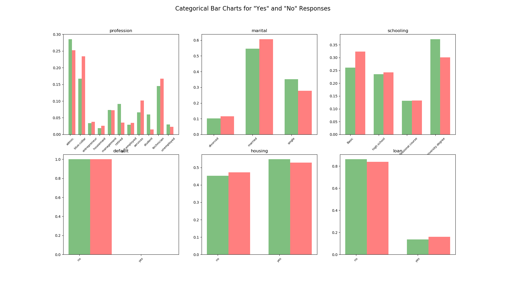

# Classification Model to Determine a Likely Customer

## Order of Operations, Generally
[x] Clean Data

[x] Exploratory Data Analysis and Visualization

[x] Create and Train Model

[x] Test Model

[x] Optimize Parameters

[x] (Optional) Repeat for other model types and determine best model

~~[ ] Visualize Results~~

I conducted some EDA and looked at the types of data. They are mixed categories (strings) and numerics. The perceived output will be a Yes/No on likely customer. 
This binary output leads me to the following model types.

## Model Types
### Naive Bayes
Advantages: This algorithm requires a small amount of training data to estimate the necessary parameters.
Naive Bayes classifiers are extremely fast compared to more sophisticated methods.
Disadvantages: Naive Bayes is is known to be a bad estimator.

### Logistic Regression
Advantages: Logistic regression is designed for this purpose (classification), and is most useful for understanding the influence of several independent variables
on a single outcome variable.
Disadvantages: Works only when the predicted variable is binary, assumes all predictors are independent of each other, and assumes data is free of missing values.

### Random Forest 
Advantages: Reduction in over-fitting and random forest classifier is more accurate than decision trees in most cases.
Another advantage is that I think RFC allows non-numeric values
Disadvantages: Slow real time prediction, difficult to implement, and complex algorithm.
note:
One thing to remember when we use Random Forest is when you use a categorical feature for training it shouldn't have more than 53 categories. 
Sometimes RandomForest takes numerical data as categorical. To overcome that make sure to convert all categorical as factors using this command.
df['col_name'] = df['col_name'].astype('category')

## EDA
Some of the model types listed above assume independence between independent variables. This is not always the case, so we should test for independence with a correlation matrix.

We can see there are some strong negative correlations between contacts. That makes sense as they would have been contacted in some # of days if they have been contacted before, else that value is 999.

I am leaning towards getting rid of that and turning it into a bool. ˉ\_(ツ)_/ˉ

### Many NaN values
```df_clean = df_clean.replace('unknown', np.NaN)```

```df_clean.isna().sum()```

```
custAge           1804
profession          61
marital              8
schooling         2386
default           1432
housing            168
loan               168
contact              0
month                0
day_of_week        711
campaign             0
pdays                0
previous             0
poutcome             0
emp.var.rate         0
cons.price.idx       0
cons.conf.idx        0
euribor3m            0
nr.employed          0
pastEmail            0
responded            0
p_last_mon           0
```

Unfortunately, I have a feeling that schooling is probably one of the strongest predictors of behavior, as "default" would be as it is a past behaviour so we can't just drop those NaN filled columns.
However, I can probably impute the custAge field with the mean of the column like so `df_clean['custAge'].fillna(df_clean['custAge'].mean(), inplace = True)`

### Why We Research
Oh my goodness, this is why we do research on the topic. I was unsure as to what data types the sklearn logistic regression can handle. So while researching logistic regression data types I found the data set :)
https://towardsdatascience.com/building-a-logistic-regression-in-python-step-by-step-becd4d56c9c8
I promise I did not see it until this point.

Looks like logistic regression it will be.

Don't worry, I will follow up with a random forest and fine tune parameters and show confusion matrices. Let's see if we can beat their F1 score. I'll bet yes.

```
columns are:
['custAge', 'profession', 'marital', 'schooling', 'default', 'housing',
       'loan', 'contact', 'month', 'day_of_week', 'campaign', 'pdays',
       'previous', 'poutcome', 'emp.var.rate', 'cons.price.idx',
       'cons.conf.idx', 'euribor3m', 'nr.employed', 'pastEmail', 'responded',
       'p_last_mon']

want bar charts for caterogical data and histogram for numeric data
Numeric:
custAge, pdays, cons.price.idx, cons.conf.idx, euribor3m, nr.employed, past_Email

Categorical:
profession, marital, schooling, default, housing, loan

Where responded is the ind var.
```

This is clearly an unbalanced data set


We are looking for the biggest discriminating factors here, so `nr.employed euribor3m pdays` look like good candidates. Think "opposite distributions" 


Let's look at the same data but now normalized over `yes` and `no` responses




Some potentially stellar indicators here.

## Model Creation and Fitting
I will create two models: a Logistic Regression and a Random Forest Classifier
### Imbalanced Data Set
Due to the imbalanced nature of the data I will use the standard SMOTE algorithm (Synthetic Minority Oversampling Technique). 
>At a high level, SMOTE:
>Works by creating synthetic samples from the minor class (no-subscription) instead of creating copies.
>Randomly choosing one of the k-nearest-neighbors and using it to create a similar, but randomly tweaked, new observations.


```Results: Logit
================================================================
Model:              Logit            Pseudo R-squared: 0.642
Dependent Variable: y                AIC:              1757.7856
Date:               2020-03-23 20:21 BIC:              2063.4719
No. Observations:   3340             Log-Likelihood:   -828.89
Df Model:           49               LL-Null:          -2315.1
Df Residuals:       3290             LLR p-value:      0.0000
Converged:          0.0000           Scale:            1.0000
No. Iterations:     35.0000
-----------------------------------------------------------------
      Coef.     Std.Err.     z      P>|z|     [0.025      0.975]
-----------------------------------------------------------------
x1     6.0282     0.3783   15.9350  0.0000      5.2868     6.7697
x2   -11.1227  2378.3418   -0.0047  0.9963  -4672.5870  4650.3416
x3    -1.4082     0.3902   -3.6086  0.0003     -2.1730    -0.6433
x4    -2.9850     0.2859  -10.4411  0.0000     -3.5454    -2.4247
x5    -3.3089     0.2915  -11.3527  0.0000     -3.8801    -2.7376
x6    -2.3155     0.2646   -8.7505  0.0000     -2.8341    -1.7968
x7    -2.8848     0.2841  -10.1558  0.0000     -3.4415    -2.3281
x8    -3.0602     0.2845  -10.7577  0.0000     -3.6178    -2.5027
x9     0.6188     0.5011    1.2350  0.2168     -0.3633     1.6010
x10   -0.5207     0.2410   -2.1602  0.0308     -0.9931    -0.0483
x11    3.8008     0.5280    7.1986  0.0000      2.7660     4.8356
x12  -14.2244  3178.6132   -0.0045  0.9964  -6244.1918  6215.7429
x13   -0.4642     0.3665   -1.2665  0.2053     -1.1826     0.2542
x14   -1.1585     0.2012   -5.7565  0.0000     -1.5529    -0.7641
x15    0.3529     0.2603    1.3559  0.1751     -0.1572     0.8630
x16    0.4404     0.2514    1.7518  0.0798     -0.0523     0.9331
x17   -0.6740     0.4377   -1.5398  0.1236     -1.5319     0.1839
x18   -2.4068     0.9480   -2.5389  0.0111     -4.2649    -0.5488
x19   -2.9662     0.3189   -9.3027  0.0000     -3.5911    -2.3412
x20   -2.7899     0.3471   -8.0378  0.0000     -3.4703    -2.1096
x21   -3.4330     0.4971   -6.9055  0.0000     -4.4074    -2.4586
x22   -4.4743     0.7909   -5.6570  0.0000     -6.0245    -2.9241
x23   -3.2660     0.3930   -8.3101  0.0000     -4.0362    -2.4957
x24   -2.6939     0.4739   -5.6845  0.0000     -3.6228    -1.7651
x25   -3.2314     0.4733   -6.8268  0.0000     -4.1591    -2.3037
x26   -3.5447     0.4025   -8.8063  0.0000     -4.3336    -2.7557
x27   -2.4052     0.6198   -3.8807  0.0001     -3.6199    -1.1904
x28   -3.1454     0.3396   -9.2614  0.0000     -3.8110    -2.4797
x30   -1.3463     0.2949   -4.5649  0.0000     -1.9243    -0.7682
x31   -1.2260     0.2911   -4.2109  0.0000     -1.7966    -0.6554
x32   -1.7330     0.3349   -5.1747  0.0000     -2.3894    -1.0766
x33   -0.9927     0.2714   -3.6577  0.0003     -1.5246    -0.4608
x34    1.8581     0.2506    7.4149  0.0000      1.3669     2.3492
x35    1.2741     0.2482    5.1339  0.0000      0.7877     1.7605
x36    0.8378     0.3104    2.6993  0.0069      0.2295     1.4461
x37   -1.7214     0.2041   -8.4353  0.0000     -2.1213    -1.3214
x38   -2.3612     0.6322   -3.7352  0.0002     -3.6002    -1.1222
x39   -1.6250     0.2575   -6.3109  0.0000     -2.1297    -1.1203
x40    0.1315     0.3285    0.4002  0.6890     -0.5124     0.7754
x41    0.3401     0.2493    1.3643  0.1725     -0.1485     0.8287
x42    0.1114     0.2634    0.4231  0.6722     -0.4047     0.6276
x43   -2.4404     0.4895   -4.9852  0.0000     -3.3999    -1.4810
x44   -2.0035     0.2694   -7.4361  0.0000     -2.5315    -1.4754
x45   -2.7015     0.2952   -9.1505  0.0000     -3.2801    -2.1228
x46   -2.5859     0.3148   -8.2142  0.0000     -3.2029    -1.9689
x47   -1.7127     0.2962   -5.7823  0.0000     -2.2932    -1.1322
x48   -2.7774     0.4692   -5.9195  0.0000     -3.6970    -1.8578
x49   -1.3273     0.6176   -2.1491  0.0316     -2.5377    -0.1168
x50   -1.3763     0.7093   -1.9403  0.0523     -2.7664     0.0139
================================================================```
```
get rid of high p values columns

# Train, Fit, and Test the Model
# Results
Suprisingly good Confusion Matrix
```
              precision    recall  f1-score   support

       False       0.92      0.97      0.94       514
        True       0.96      0.91      0.94       488

    accuracy                           0.94      1002
   macro avg       0.94      0.94      0.94      1002
weighted avg       0.94      0.94      0.94      1002
```
From here you really should do a cross-validation of the data to calculate your confidence interval as well as ensure you have not overfit the model. 
But I'll just do a Random Forest instead.

Which also has a suprisingly good confusion matrix
```              precision    recall  f1-score   support

       False       0.94      0.92      0.93       693
        True       0.92      0.93      0.93       643

    accuracy                           0.93      1336
   macro avg       0.93      0.93      0.93      1336
weighted avg       0.93      0.93      0.93      1336
```

Now these are so good I want to go find the original data set and train and test against it.
for reference, here is the original data set: 
http://archive.ics.uci.edu/ml/datasets/Bank+Marketing
And no, unfortunately I did not train and test against it.
