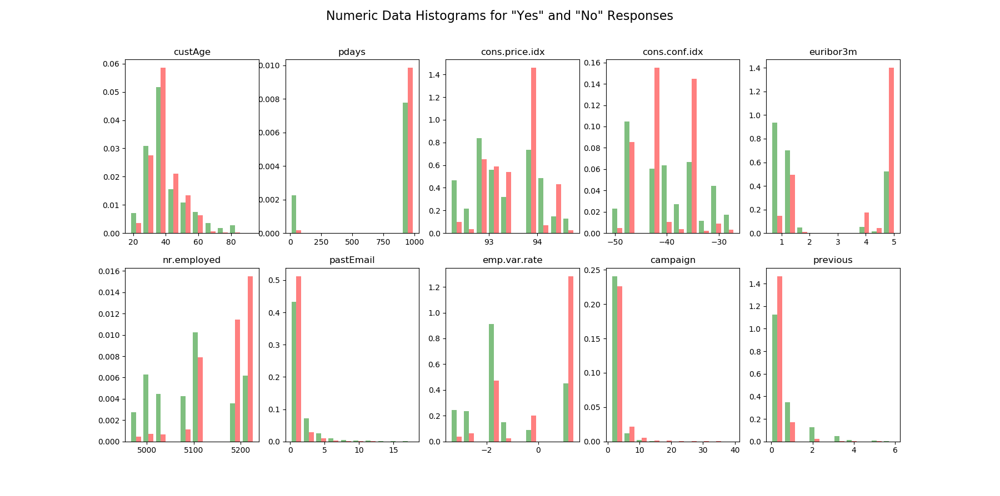

# Classification Model to Determine a Likely Customer

## Order of Operations, Generally
[x] Clean Data

[x] Exploratory Data Analysis and Visualization

[ ] Create and Train Model

[ ] Test Model

[ ] Optimize Parameters

[ ] (Optional) Repeat for other model types and determine best model

[ ] Visualize Results

I conducted some EDA and looked at the types of data. They are mixed categories (strings) and numerics. The perceived output will be a Yes/No on likely customer. 
This binary output leads me to the following model types.

## Model Types
### Naive Bayes
Advantages: This algorithm requires a small amount of training data to estimate the necessary parameters.
Naive Bayes classifiers are extremely fast compared to more sophisticated methods.
Disadvantages: Naive Bayes is is known to be a bad estimator.

### Logistic Regression
Advantages: Logistic regression is designed for this purpose (classification), and is most useful for understanding the influence of several independent variables
on a single outcome variable.
Disadvantages: Works only when the predicted variable is binary, assumes all predictors are independent of each other, and assumes data is free of missing values.

### Random Forest 
Advantages: Reduction in over-fitting and random forest classifier is more accurate than decision trees in most cases.
Another advantage is that I think RFC allows non-numeric values
Disadvantages: Slow real time prediction, difficult to implement, and complex algorithm.
note:
One thing to remember when we use Random Forest is when you use a categorical feature for training it shouldn't have more than 53 categories. 
Sometimes RandomForest takes numerical data as categorical. To overcome that make sure to convert all categorical as factors using this command.
df['col_name'] = df['col_name'].astype('category')

## EDA
Some of the model types listed above assume independence between independent variables. This is not always the case, so we should test for independence with a correlation matrix.

We can see there are some strong negative correlations between contacts. That makes sense as they would have been contacted in some # of days if they have been contacted before, else that value is 999.

I am leaning towards getting rid of that and turning it into a bool. ˉ\_(ツ)_/ˉ

### Many NaN values
```df_clean = df_clean.replace('unknown', np.NaN)```

```df_clean.isna().sum()```

```
custAge           1804
profession          61
marital              8
schooling         2386
default           1432
housing            168
loan               168
contact              0
month                0
day_of_week        711
campaign             0
pdays                0
previous             0
poutcome             0
emp.var.rate         0
cons.price.idx       0
cons.conf.idx        0
euribor3m            0
nr.employed          0
pastEmail            0
responded            0
p_last_mon           0
```

Unfortunately, I have a feeling that schooling is probably one of the strongest predictors of behavior, as "default" would be as it is a past behaviour so we can't just drop those NaN filled columns.
However, I can probably impute the custAge field with the mean of the column like so `df_clean['custAge'].fillna(df_clean['custAge'].mean(), inplace = True)`

### Why We Research
Oh my goodness, this is why we do research on the topic. I was unsure as to what data types the sklearn logistic regression can handle. So while researching logistic regression data types I found the data set :)
https://towardsdatascience.com/building-a-logistic-regression-in-python-step-by-step-becd4d56c9c8
I promise I did not see it until this point.

Looks like logistic regression it will be.

Don't worry, I will follow up with a random forest and fine tune parameters and show confusion matrices. Let's see if we can beat their F1 score. I'll bet yes.

```
columns are:
['custAge', 'profession', 'marital', 'schooling', 'default', 'housing',
       'loan', 'contact', 'month', 'day_of_week', 'campaign', 'pdays',
       'previous', 'poutcome', 'emp.var.rate', 'cons.price.idx',
       'cons.conf.idx', 'euribor3m', 'nr.employed', 'pastEmail', 'responded',
       'p_last_mon']

want bar charts for caterogical data and histogram for numeric data
Numeric:
custAge, pdays, cons.price.idx, cons.conf.idx, euribor3m, nr.employed, past_Email

Categorical:
profession, marital, schooling, default, housing, loan

Where responded is the ind var.
```

This is clearly an unbalanced data set


We are looking for the biggest discriminating factors here, so `nr.employed euribor3m pdays` look like good candidates. Think "opposite distributions" 


Let's look at the same data but now normalized over `yes` and `no` responses




Some potentially stellar indicators here.

## Model Creation and Fitting
I will create two models: a Logistic Regression and a Random Forest Classifier
### Imbalanced Data Set
Due to the imbalanced nature of the data I will use the standard SMOTE algorithm (Synthetic Minority Oversampling Technique). 
>At a high level, SMOTE:
>Works by creating synthetic samples from the minor class (no-subscription) instead of creating copies.
>Randomly choosing one of the k-nearest-neighbors and using it to create a similar, but randomly tweaked, new observations.


```Optimization terminated successfully.
         Current function value: 0.429966
         Iterations 7
print(predict.summary2())
                        Results: Logit
=================================================================
Model:              Logit            Pseudo R-squared: 0.380
Dependent Variable: y                AIC:              11346.3908
Date:               2020-03-23 13:47 BIC:              11496.0713
No. Observations:   13148            Log-Likelihood:   -5653.2
Df Model:           19               LL-Null:          -9113.5
Df Residuals:       13128            LLR p-value:      0.0000
Converged:          1.0000           Scale:            1.0000
No. Iterations:     7.0000
-------------------------------------------------------------------
          Coef.    Std.Err.      z       P>|z|     [0.025    0.975]
-------------------------------------------------------------------
x1       -2.9530     0.0821   -35.9632   0.0000   -3.1139   -2.7920
x3       -3.9923     0.1922   -20.7721   0.0000   -4.3690   -3.6156
x4       -4.2479     0.2467   -17.2175   0.0000   -4.7315   -3.7644
x5       -3.6007     0.1285   -28.0199   0.0000   -3.8525   -3.3488
x6       -1.8925     0.1191   -15.8963   0.0000   -2.1259   -1.6592
x7       -4.3178     0.2165   -19.9463   0.0000   -4.7421   -3.8935
x8       -3.8409     0.1245   -30.8602   0.0000   -4.0849   -3.5970
x9       -1.8333     0.1640   -11.1807   0.0000   -2.1547   -1.5120
x10      -3.6484     0.0973   -37.5140   0.0000   -3.8390   -3.4578
x11      -3.7648     0.2169   -17.3573   0.0000   -4.1900   -3.3397
x12      -0.3553     0.1069    -3.3229   0.0009   -0.5649   -0.1457
x13       0.3703     0.0712     5.1984   0.0000    0.2307    0.5100
x14       3.4833     0.0883    39.4349   0.0000    3.3102    3.6564
x15       2.0726     0.1020    20.3255   0.0000    1.8728    2.2725
x16      -0.7685     0.0729   -10.5413   0.0000   -0.9114   -0.6256
x17      -0.5880     0.0701    -8.3829   0.0000   -0.7255   -0.4505
x18      -1.2550     0.1173   -10.7009   0.0000   -1.4848   -1.0251
x19      -0.5382     0.0733    -7.3414   0.0000   -0.6819   -0.3946
x20      -0.5165     0.0806    -6.4073   0.0000   -0.6746   -0.3585
=================================================================```
```
All p values look good. In fact they all look *too* good. Reviewing the data shows that only categorical data were deemed important and I don't believe that with how good some of the numeric data looked. So I am going to skip this step.

*Update* I tried skipping that step and got a singular matrix when solving for my logistic regression so I went back and categorized the numeric data and *that* worked.

